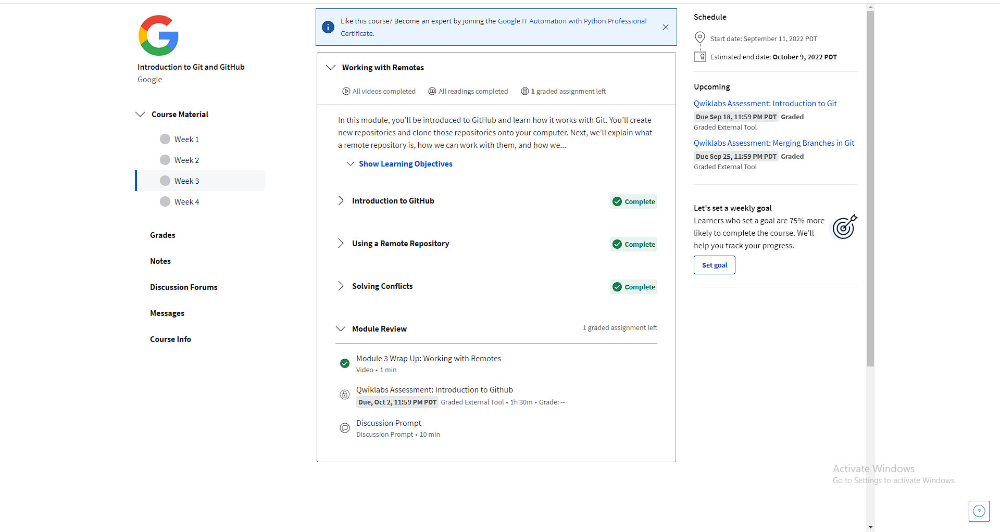
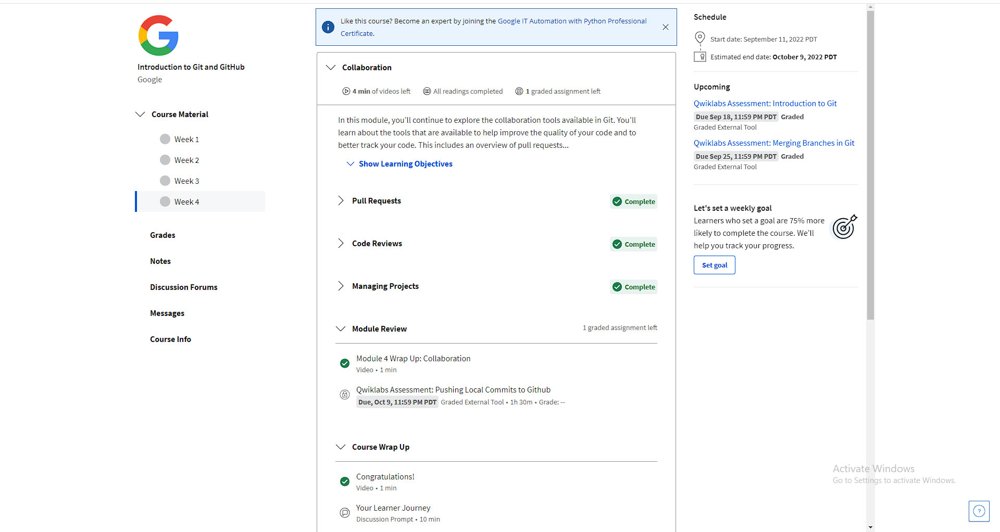

# kottans-frontend
Repository for [kottans.org](https://github.com/kottans/frontend) courses 2022.

***

 

## Roadmap course

0. [Git Basics](#task-0-git-basics)
    1. [Introduction to Git and Github. Week 1 and 2](#01-introduction-to-git-and-github-week-1-and-2)
    2. [Learn Git Branching](#02-learn-git-branching)

     
1. [Linux CLI and HTTP](#task-1-linux-cli-and-http)
2. [GitHub and Collaboration](#task-2-git-collaboration)
    1. [Introduction to Git and Github. Week 3 and 4](#21-introduction-to-git-and-github-week-3-and-4)
    2. [Learn Git Branching - Advanced Topics](#22-learn-git-branching---advanced-topics)
    3. [Learn Git Branching - Advanced Topics](#23-learn-git-branching---advanced-topics-optional) (optional)

     
3. [Intro to HTML and CSS](#task-3-intro-to-html-and-css)
    1. [HTML, CSS, and Javascript for Web Developers. Week 1 and 2](#31-html-css-and-javascript-for-web-developers-week-1-and-2)
    2. [Codecademy - Learn HTML](#32-learn-html)
    3. [Codecademy - Learn CSS](#33-learn-css)

     
4. Responsive Web Design
5. HTML & CSS Practice
6. JavaScript Basics
7. Document Object Model - practice
8. Building a Tiny JS World (pre-OOP) - practice
9. Object oriented JS - practice
10. OOP exercise - practice
11. Offline Web Applications - optional
12. Memory pair game — real project!
13. Website Performance Optimization - optional
14. Friends App - real project!

 

***

## Task 0. Git Basics

***

 

Багато команд, яких я взагалі не використовував. Розумію, що ці команди в більшості випадків використовують в команді, тому рано чи пізно доведеться з ними більш детально розібратись, але в мене вже склалась загальна картина для чого їх використовувати.
Після проходження першого етапу зрозімів, що з гітом велика каша і поки на практиці всі команди не попробуєш, то важко буде запам'ятати.

 

### 0.1. Introduction to Git and GitHub. Week 1 and 2
[Roadmap](#roadmap-course)

 

 

### 0.2. Learn Git Branching
[Roadmap](#roadmap-course)

 

 

***

## Task 1. Linux CLI and HTTP
[Roadmap](#roadmap-course)

***

 

Колись давно встановлював та вивчав FreeBSD для пошуку роботи на посаду Системного адміністратора. Часто використовув ls - аналог dir в командній строці Windows, chmod, cp, cat, man та інші специфічні, але більшість з них вже не пам'ятаю.

 

 

***

## Task 2. Git Collaboration

***

 

### 2.1. Introduction to Git and GitHub. Week 3 and 4
[Roadmap](#roadmap-course)

Було легше проходити цю частину, бо більшість вже знав команд.

 

 

### 2.2. Learn Git Branching - Advanced Topics
[Roadmap](#roadmap-course)

Складніші завдання, але нова команда cherry-pick з нею простіше, ніколи не користувався.

 

 

### 2.3. Learn Git Branching - Advanced Topics (optional)
[Roadmap](#roadmap-course)

Додаткові завдання пройшов швидко, бо знав, як використовувати cherry-pick та rebase. Не складні завдання були, але в деяких були обмеження на використання деяких команд.

 

***

## Task 3. Intro to HTML and CSS

***

 

### 3.1 HTML, CSS, and Javascript for Web Developers. Week 1 and 2
[Roadmap](#roadmap-course)

До проходження курсу, я вже знав, як користуватись HTML та CSS. Тому, для мене не було складно пройти курс, тільки повторив.

 

 

### 3.2 Learn HTML
[Roadmap](#roadmap-course)

 

 

### 3.3 Learn CSS
[Roadmap](#roadmap-course)

 

***

[Roadmap](#roadmap-course)
