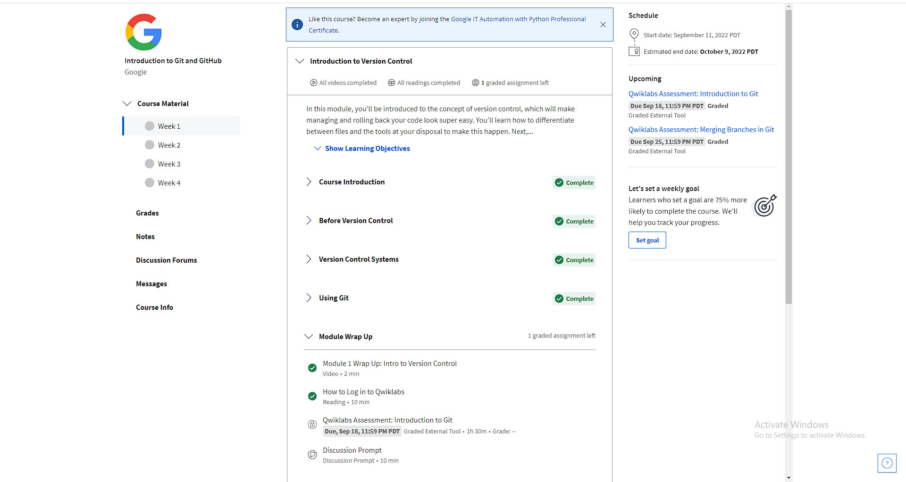
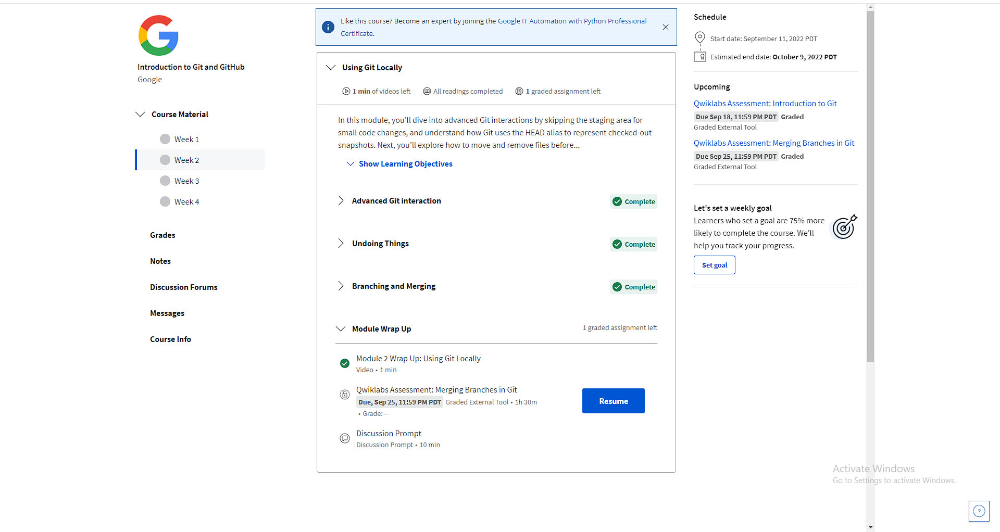
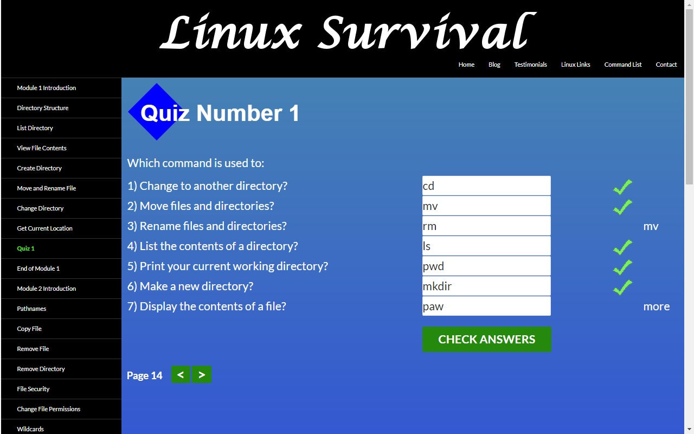
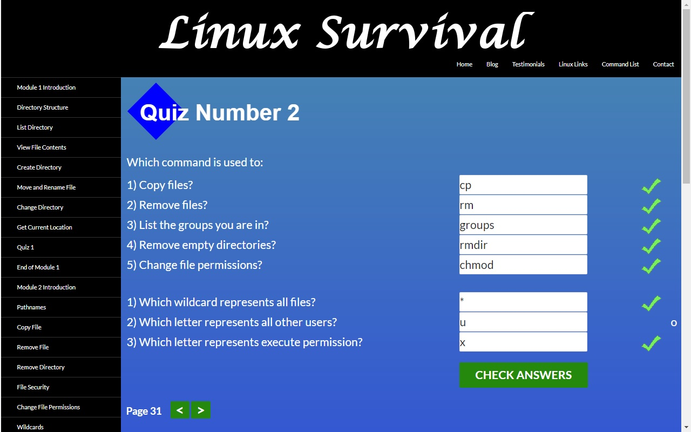
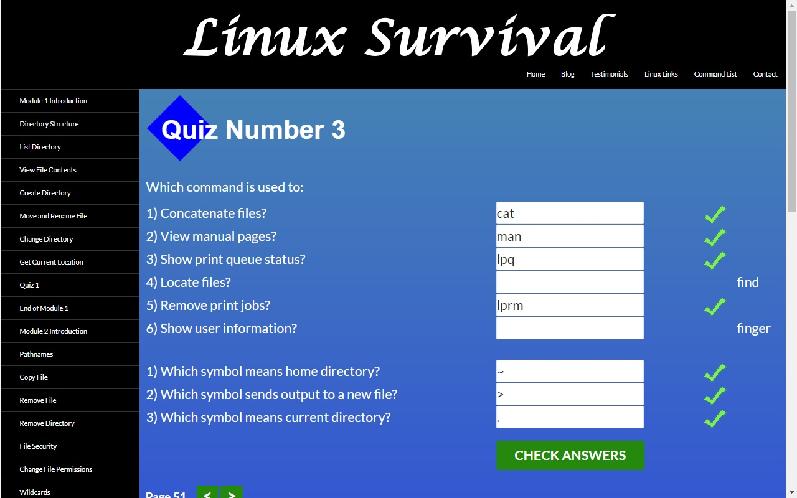
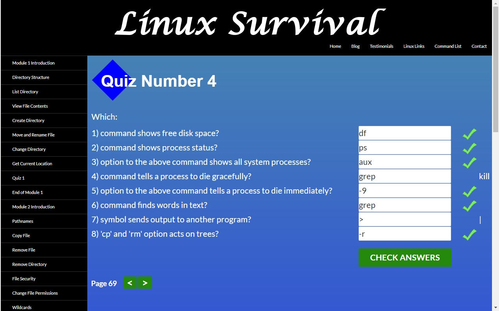

# kottans-frontend
Repository for [kottans.org](https://github.com/kottans/frontend) courses 2022.

## Task #0. Git Basics

***

Багато команд, яких я взагалі не використовував. Розумію, що ці команди в більшості випадків використовують в команді, тому рано чи пізно доведеться з ними більш детально розібратись, але в мене вже склалась загальна картина для чого їх використовувати.
Після проходження першого етапу зрозімів, що з гітом велика каша і поки на практиці всі команди не попробуєш, то важко буде запам'ятати.

### 1. Introduction to Git and GitHub

### 2. Learn Git Branching

 

## Task #1. Linux CLI, and HTTP

***

### 1. Linux Survival (4 modules)

Колись давно встановлював та вивчав FreeBSD для пошуку роботи на посаду Системного адміністратора. Часто використовув ls - аналог dir в командній строці Windows, chmod, cp, cat, man та інші специфічні, але більшість з них вже не пам'ятаю.

